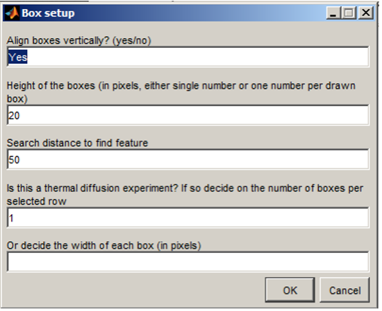
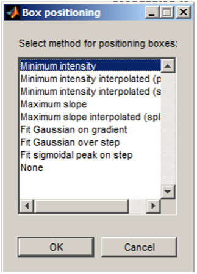
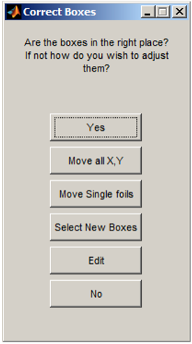

# Make Boxes

Either run:
```
ImageAnalysis('file name', ‘boxes’)
```
Or set the switch in manytimes to ‘boxes’ and run. Two files are created by this routine (1) ‘file name_boxes.mat’ and ‘file name_boxes.tiff’. The first is a matlab mat file containing the x,y positions of the selected boxes and the second in an image of these boxes overlaid on the reference X-radiograph.




Running ‘boxes’ option opens and plots the reference image of the left hand side of the screen. This is followed by a series of dialogue boxes which aid the location and selection of the boxes. If there are multiple sets of data the boxes are propagated from one data set to the next via a file called data_prev.mat. If data_prev.mat exists it is assumed the box selection routine optimises the box position and presents the dialogue box for 
1.	**Rotation of the image**
The rotation is anti-clockwise about the centre of the image and is propagated to all images in the data series. The boxes are selected on the rotated image. 
2.	**Select the box positions**
Select the top left and bottom right corner of the desired boxes in the image. When all the boxes of interest are selected press ENTER. If the experiment is a thermal diffusivity experiment select the full width of the foil and this area is cut into smaller boxes in the next step. 
3.	**Box size and location selection**
Dialogue boxes to automatically size and locate the boxes follow.  The first window allows for the cutting of the selected areas into many horizontal sections (for thermal diffusivity experiments) and setting the vertical height of the boxes. It is recommended that the heights of the boxes in the image are a little greater than the shadow of the foils (but this can be adjusted later).




The second dialogue box is for the selection of the method for automatically position the boxes over the features in the image. The box is centred over the feature selected and the options in the list have the following meanings:

Option |  Description
------ | ------
Minimum intensity	| Finds the pixel row in the box with the minimum intensity.
Minimum intensity interpolated (poly)	| Uses a polynomial to interpolate between the rows to find the minimum intensity.
Minimum intensity interpolated (spline)	| Uses a spline to interpolate between the rows to find the minimum intensity.
Maximum slope	| Finds the pixel row which has the maximum intensity gradient. For the foils in the top half of the image it looks for the gradient on the top of the foil and in the bottom of the image in the bottom of the foil 
Maximum slope interpolated (spline)	| Uses a polynomial to interpolate between the rows to find the maximum intensity gradient. For the foils in the top half of the image it looks for the gradient on the top of the foil and in the bottom of the image in the bottom of the foil

4.	**Validate the positions**
The script locates the boxes using the setting above, plots the box locations on the image and presents the following dialogue box: 



If the boxes are in the right place press “yes”, then the box positions are saved and second image figure appears on the right hand side of the screen with the boxes shown. This image is saved. If the boxes are not in the correct position use one of the other options:

Option            |  Description
------            | ------
Yes	              | Finds the pixel row in the box with the minimum intensity.
Move all X,Y	    | Allows the moving of all the boxes in X and Y. Used if the press was moved between data sets.
Move Single Foils	| Allows single foils to be moved manually. 
Select New Boxes	| Returns the script to the image rotation option and allows the selection of a new set of boxes.  
Edit 	            | Allows manual editing of the boxes via the command line. 
No	              | Generates and error and quits the box selection. 

5.	**Move all (X,Y)**
Text 
6.	**An option Position single foil**
Text
